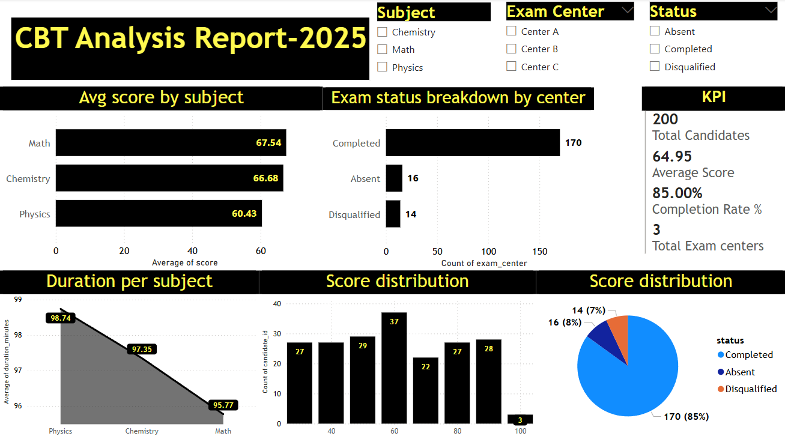

# CBT Performance Dashboard - Power BI

This Power BI dashboard analyzes data from a simulated Computer-Based Testing (CBT) system with 200 candidate records.

## 🔍 Features

- KPI cards for Total Candidates, Average Score, and Completion Rate
- Score analysis by subject
- Test duration trends
- Completion status breakdown by center
- Interactive slicers for Subject, Center, and Status
- Score distribution histogram and pie chart

## 📂 Files

- `CBT_Dashboard.pbix` – Power BI file
- `dashboard_screenshot.png` – Preview image of the report

## 📊 Tools Used

- Power BI
- DAX
- CSV data transformation

## 📈 Sample Screenshot

